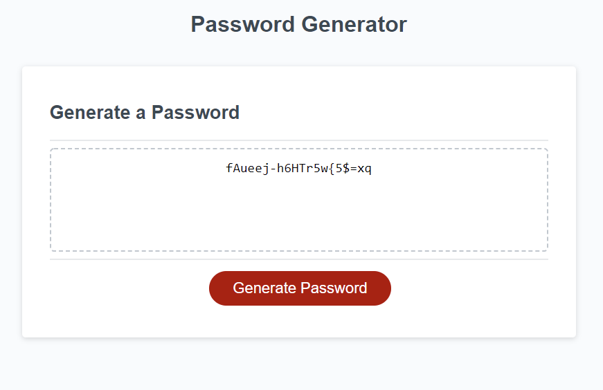

# Random Password Generator

## Description
This password generator will go through a series of prompts to ask the user what kinds of characters it would like to use for the password and how long the password should be.

This is our week 3 challenge to use the JavaScipt we have learned so far and apply it through using arrays and for loops to generate a random password using only the selected criteria gathered through the prompts.

Going through this project felt more like a challenge on how we could use our resources (Google) and a reiteration of the importance of pseudo coding. When I tried to start this project my mind went into so many different directions I quickly realized I needed to slow down and start to pseudo code!

## Built With:
* HTML
* CSS
* Javascript

## Preview
The finished product: https://oceanlatte.github.io/password-generator/

## Credits
There was a couple of issues I had with my original plan and through many Google searches I was able to find the pieces I needed to finish the project.
* Array concat(): https://www.w3schools.com/jsref/jsref_concat_array.asp, https://developer.mozilla.org/en-US/docs/Web/JavaScript/Reference/Global_Objects/Array/concat
* Math.random: https://www.freecodecamp.org/news/how-to-use-javascript-math-random-as-a-random-number-generator/
* Empty arrays: https://www.quora.com/How-do-you-declare-an-empty-array-in-JavaScript

